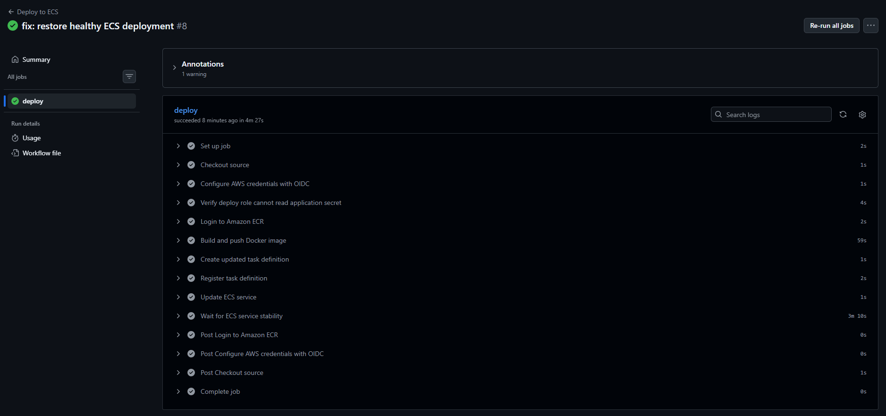
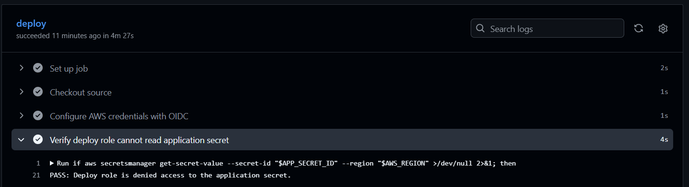
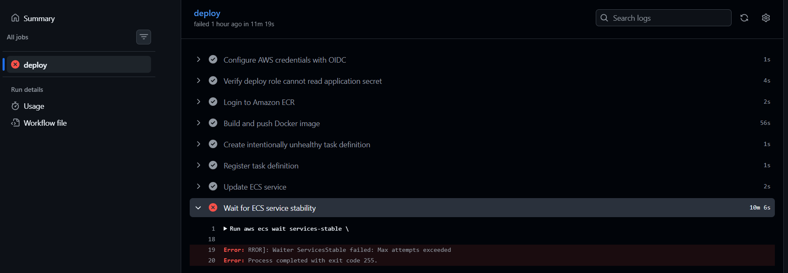
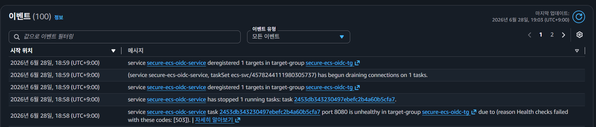
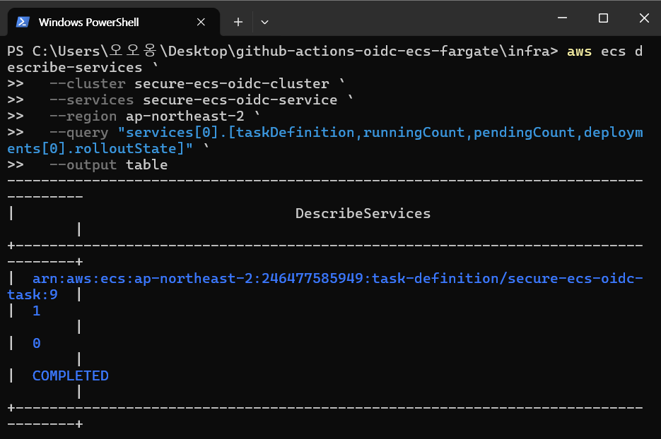
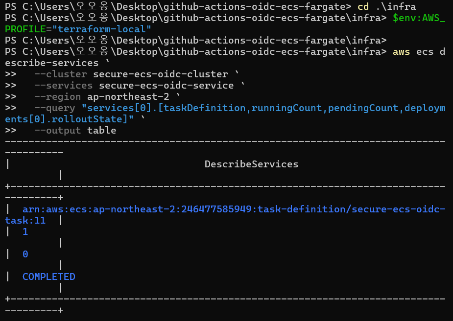
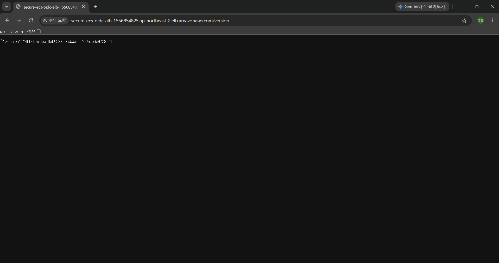
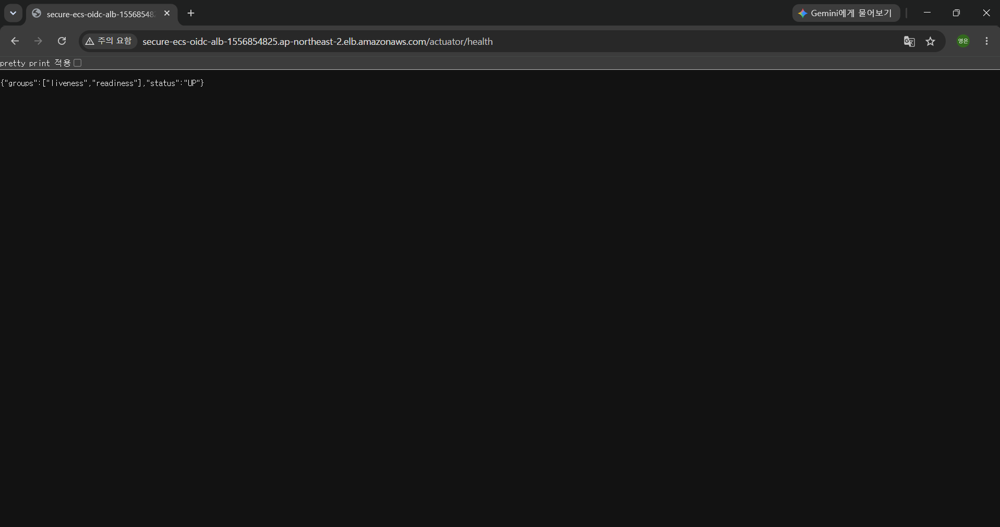
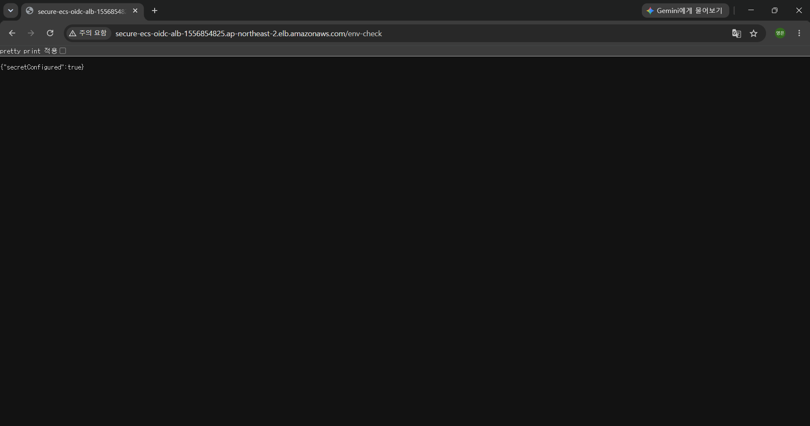

# GitHub Actions OIDC 기반 최소 권한 ECS Fargate 배포 파이프라인

GitHub Actions OIDC와 Terraform을 활용해 장기 AWS Access Key 없이 Spring Boot 애플리케이션을 Amazon ECS Fargate에 자동 배포한 프로젝트입니다.

## 핵심 목표

- GitHub Actions에서 장기 AWS Access Key 없이 OIDC 기반 임시 자격 증명 사용
- Terraform으로 AWS 인프라를 코드로 관리
- GitHub Deploy Role, ECS Task Execution Role, ECS Task Role 분리
- Secrets Manager를 통한 Secret 주입
- ALB Health Check 기반 배포 상태 검증
- 의도적 장애 발생 후 수동 롤백까지 검증

## Tech Stack

- Application: Java 21, Spring Boot, Gradle
- Container: Docker
- CI/CD: GitHub Actions
- Infrastructure as Code: Terraform
- AWS: VPC, ALB, ECR, ECS Fargate, IAM, OIDC, Secrets Manager, CloudWatch Logs

## Deployment Flow

    Developer Push
    → GitHub Actions
    → GitHub OIDC Token
    → AWS STS AssumeRole
    → Gradle Build
    → Docker Build
    → Amazon ECR Push
    → ECS Task Definition Registration
    → ECS Service Update
    → ALB Health Check
    → ECS Service Stable

## Infrastructure Overview

- VPC와 2개의 Public Subnet 구성
- Application Load Balancer가 외부 HTTP 요청 수신
- ALB는 ECS Fargate Task의 8080 포트로 요청 전달
- Target Group Health Check 경로는 `/actuator/health`
- 애플리케이션 로그는 CloudWatch Logs로 전송
- Secret은 Secrets Manager에서 ECS Task Execution Role을 통해 주입

## IAM Least Privilege Design

### GitHub Deploy Role

GitHub Actions 전용 배포 Role입니다.

허용 권한:

- ECR 로그인 및 Docker 이미지 Push
- ECS Task Definition 조회 및 등록
- ECS Service 업데이트
- ECS 실행에 필요한 제한된 `iam:PassRole`

제한 사항:

- Secrets Manager `GetSecretValue` 권한 없음
- 애플리케이션 Secret 값 직접 조회 불가

### ECS Task Execution Role

컨테이너 시작에 필요한 권한만 담당합니다.

- ECR 이미지 Pull
- CloudWatch Logs 전송
- Secrets Manager Secret 주입

### ECS Task Role

애플리케이션 런타임 권한용 Role입니다.

현재는 애플리케이션이 AWS SDK로 별도 서비스를 호출하지 않으므로 권한을 부여하지 않았습니다.

## OIDC Authentication

GitHub Actions는 AWS Access Key를 GitHub Secret에 저장하지 않습니다.

OIDC Trust Policy에서 다음 조건을 제한했습니다.

- 특정 GitHub Repository만 허용
- `main` 브랜치만 AssumeRole 허용
- Audience는 `sts.amazonaws.com`으로 제한

## Validation Results

### 1. GitHub Actions 정상 배포

### 2. Deploy Role의 Secret 접근 차단

GitHub Deploy Role에는 `secretsmanager:GetSecretValue` 권한을 부여하지 않았고, Workflow에서 Secret 조회가 거부되는 것을 확인했습니다.

### 3. 의도적 Health Check 실패

`FAIL_HEALTHCHECK=true` 환경변수로 `/actuator/health`가 실패하도록 배포했고, GitHub Actions의 ECS 안정화 대기 단계가 실패하는 것을 확인했습니다.

### 4. ECS Unhealthy 이벤트 확인

ALB Health Check 요청에 애플리케이션이 HTTP 503을 반환했고, Target Group이 해당 Task를 unhealthy로 판정했습니다. 이후 ECS Service가 unhealthy Task를 교체하려고 시도한 이벤트를 확인했습니다.

### 5. 수동 롤백

정상 Task Definition Revision 9를 명시적으로 지정해 수동 롤백한 뒤, ECS Service가 `COMPLETED` 상태로 복구된 것을 확인했습니다.

### 6. 최종 정상 재배포

실패 테스트 설정 제거 후 GitHub Actions로 정상 배포를 다시 수행했고, ECS Service가 Revision 11에서 `COMPLETED` 상태가 된 것을 확인했습니다.

### 7. 애플리케이션 배포 버전 확인

`/version` 엔드포인트를 통해 Git Commit SHA 기반 버전이 ECS 환경에서 실행 중임을 확인했습니다.

### 8. 애플리케이션 Health Check 확인

`/actuator/health`가 `UP` 상태를 반환하는 것을 확인했습니다.

### 9. Secret 환경변수 주입 확인

Secret 실제 값은 노출하지 않고, `/env-check`로 ECS Task에 Secret 환경변수가 정상 주입됐는지만 확인했습니다.

## Failure Test and Rollback Flow

    정상 Revision 9 배포
    → FAIL_HEALTHCHECK=true 적용
    → 새 Task의 /actuator/health가 503 반환
    → ALB Target Group unhealthy 판정
    → ECS가 unhealthy Task 교체 시도
    → GitHub Actions ECS 안정화 대기 실패
    → 정상 Revision 9를 지정해 수동 롤백
    → ECS Service COMPLETED 상태 확인
    → 실패 테스트 설정 제거
    → Revision 11 정상 재배포 완료

## Troubleshooting

### ECS Health Check 실패

Spring Boot 초기 기동 전에 ALB Health Check가 동작하면 새 ECS Task가 빠르게 unhealthy로 판단될 수 있었습니다.

    health_check_grace_period_seconds = 90

### Terraform Destroy 중 ECR Repository 삭제 실패

ECR Repository에 이미지가 남아 있어 삭제가 실패한 경험이 있었습니다.

    force_delete = true

`force_delete = true`를 적용해 테스트 환경 정리 시 ECR 이미지도 함께 제거되도록 구성했습니다.

### Secrets Manager 삭제 예약 상태

Terraform Destroy 후 Secret이 삭제 예약 상태가 되어 같은 이름으로 재생성할 때 충돌이 발생했습니다.

Secret을 restore한 뒤 Terraform import로 state에 다시 등록해 해결했습니다.

## What I Learned

- GitHub Actions OIDC를 사용하면 장기 AWS Access Key 없이 CI/CD를 구성할 수 있다.
- IAM Role을 역할별로 분리하면 권한 범위를 줄일 수 있다.
- ECS 배포는 Task Definition 등록뿐 아니라 ALB Health Check와 Service 안정화까지 확인해야 한다.
- 장애를 재현하고 ECS 이벤트를 기반으로 원인을 확인한 뒤 롤백하는 과정이 중요하다.
- Terraform에서는 리소스 삭제 순서와 state 관리도 함께 고려해야 한다.

## Future Improvements

- ECS Deployment Circuit Breaker 적용
- CodeDeploy Blue/Green 배포 적용
- Private Subnet, NAT Gateway 또는 VPC Endpoint 기반 구조로 개선
- Terraform Remote Backend 구성: S3 + DynamoDB Locking
- CloudWatch Alarm 및 배포 실패 알림 구성